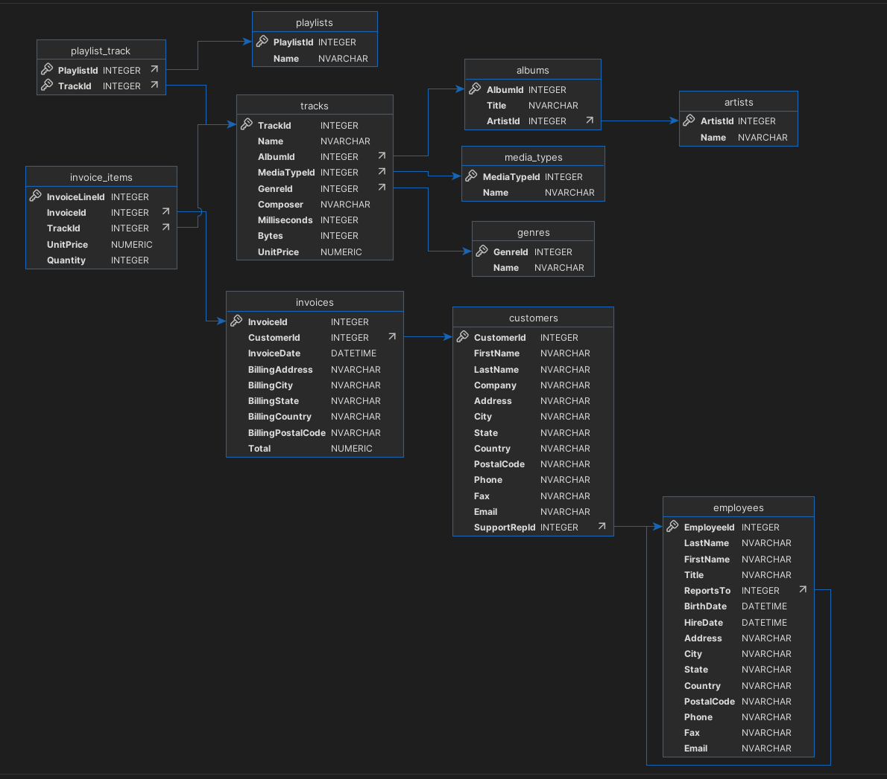

# SQLite Zero To Hero

SQLite Zero To Hero using www.sqlitetutorial.net

## Getting Started

chinook database:

### SQLite Sample Database

1. open sqlite3: *sqlite3*
1. open sqlite3 and db: *sqlite3 chinook.db*
1. open db: *.open chinook.db*
1. exit: *.quit*

### SQLite Commands

1. add a database to the current connection: *attach database "c:\sqlite\db\secdb.db" AS secdb;*
1. remove a database from the current connection: DETACH DATABASE secdb;
1. show all databases: *.database*
1. show all tables: *.table*
1. pattern matching show tables: *.table '%es'*
1. show schema of customers table: *.schema customers*
1. show all schemas: *.fullschema*
1. show index of customer table: *.index customers*
1. show all indexes: *.index*
1. saving the result of a query into a file: *.output c:/sqlite/db/output.txt*
1. output back to the standard output: *.output*
1. executing SQL statements from a file (in file we have for example *SELECT * FROM genres;*): *.read C:\sqlite\db\commands.txt*

## SQLite Tutorial

### Section 1. Simple query

#### SELECT

1. math query
    1. *SELECT 1+1;*
    1. *SELECT 1+1, 3+3;*
1. tables query
    1. *SELECT * FROM genres;*
    1. *SELECT name FROM genres;*
    1. *SELECT FirstName, BirthDate, HireDate FROM employees;*

### Section 2. Sorting rows

#### ORDER BY

1. Order by column name ascending: *SELECT * FROM genres ORDER BY Names ASC;*
1. Order by column name descending: *SELECT * FROM genres ORDER BY GenreId DESC;*
1. Order by column names: *SELECT GenreId, Name FROM tracks ORDER BY GenreId ASC, Name DESC;*
1. Order by column number: *SELECT * FROM genres ORDER BY 2;*
1. Order by column names show nulls on the records top (in first rows will shown records where composer == NULL): *SELECT name, composer FROM tracks ORDER BY composer NULLS FIRST;*
1. Order by column names show nulls on the records bottom  (in last rows will shown records where composer == NULL): *SELECT name, composer FROM tracks ORDER BY composer NULLS LAST;*

### Section 3. Filtering data

#### Select Distinct

1. remove duplicate cities from results: *SELECT DISTINCT city FROM customers;*
1. remove duplicate pair city - country from results: *SELECT DISTINCT city, country FROM customers;*
1. remove amount of NULLs:
    1. get a lot of NULLs here: *SELECT company FROM customers;*
    1. only one NULL is here: *SELECT DISTINCT company FROM customers;*

#### WHERE

1. Pattern matching: *SELECT * FROM albums WHERE title LIKE '%es';*
1. UNIX pattern matching (like regular expression): *SELECT * FROM albums WHERE title GLOB '*[1-3]*';*
1. In range (include border values): *SELECT * FROM albums WHERE ArtistId BETWEEN 50 AND 55;*
1. Operator AND: *SELECT * FROM albums WHERE ArtistId > 50 AND ArtistId < 55;*
1. IN (list of hardcoded values): *SELECT * FROM albums WHERE ArtistId IN (44, 55, 66);*
1. NOT IN (list of hardcoded values): *SELECT * FROM artists WHERE ArtistId NOT IN (11, 22, 33);*
1. IN (list as oputput of other query): *SELECT * FROM artists WHERE ArtistId IN (SELECT DISTINCT ArtistId FROM albums WHERE Title LIKE '%es' LIMIT 3);*
1. Limit rows: *SELECT * FROM albums LIMIT 20;*
1. NULL: *SELECT * FROM tracks WHERE Composer IS NULL LIMIT 10;*
1. NOT NULL: *SELECT * FROM tracks WHERE Composer IS NOT NULL LIMIT 10;*
1. 

### Section 4. Joining tables

### Section 5. Grouping data

### Section 6. Set operators

### Section 7. Subquery & CTE

### Section 8. More querying techniques

### Section 9. Changing data

### Section 10. Transactions

### Section 11. Data definition

### Section 12. Constraints

### Section 13. Views

### Section 14. Indexes

### Section 15. Triggers

### Section 16. Full-text search

### Section 17. SQLite tools
